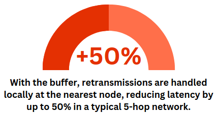

<div align="center">

# RustasticDrone
##### Your drone is Fantastic only if it is from Rustastic


</div>

# Table of Contents
- [Rustastic Drone](#rustastic-drone)
- [Features](#features)
  - [Core Features](#core-features)
  - [Testing](#testing)
  - [Debugging](#debugging)
- [Buffer](#buffer)
  - [Why Our Buffer Matters](#why-our-buffer-matters)
  - [Statistics](#statistics)
- [Comparison](#comparison)
- [Usage](#usage)
- [Assistance](#assistance)

# Rustastic Drone
The `Rustastic Drone` is a software-defined drone specifically designed for operating within a distributed network simulation. It was developed as a project for the 2024 Advanced Programming course at the [University of Trento](https://www.unitn.it/).

# Features
## Core Features
The Rustastic Drone aims for **protocol perfection**: every aspect of the protocol has been meticulously developed and refined to ensure seamless communication and flawless operation.

## Testing
The Rustastic Drone undergoes **extensive testing** to ensure robustness and performance under all conditions. Every feature and function is rigorously evaluated, covering both common and rare edge cases. Our comprehensive suite of tests leaves no room for unexpected behavior, and we are continually expanding our test coverage to guarantee reliability.

## Logging
To enhance user experience, Rustastic Drone includes a powerful **logging system**:
- Debug logs provide clear, detailed information about events and their sequence.
- Errors and actions are highlighted in distinct colors, making logs easy to read in the terminal.
- Integrated with the `log` crate ([documentation](https://docs.rs/log/latest/log/)) for seamless compatibility with loggers such as `log4rs` or `env_logger`.

These features make logging intuitive and efficient, reducing the time needed to diagnose and resolve issues.

In summary, the `Rustastic Drone` is **Simply Fantastic** because it stands out for its reliability, precision, and smart design.

# Buffer
The drone leverages an efficient `Packet Buffer` to handle dropped fragments. This buffer combines a `HashMap` with a `priority queue`, storing recently received fragments indexed by session ID and fragment number.

### Buffer Operation:
1. Upon receiving a NACK:
   - If the fragment is in the buffer, it is immediately retransmitted.
   - If not, the NACK is forwarded to the previous node, restarting the retransmission process from the original source.
2. The buffer size can be configured to meet specific requirements.

This approach minimizes delays and reduces network congestion caused by redundant retransmissions.

## Why Our Buffer Matters
Efficient packet handling is critical in drone networks where delays or packet loss can disrupt communication. Our buffer system ensures:
- Faster retransmissions.
- Reduced congestion.
- Greater reliability in challenging environments.

Whether in simulations or real-world applications, our buffer technology makes drone networks faster, smarter, and more resilient.

## Statistics
<div align="center">




</div>

# Comparison
<div align="center">


</div>

# Usage
Add the following to your `Cargo.toml`:

```toml
[dependencies]
rustastic-drone = { git = "https://github.com/Rustastic/RustasticDrone.git" }

```

Then use it in your Rust code:
``` rust
use rustastic_drone::RustasticDrone;
```

# Assistance