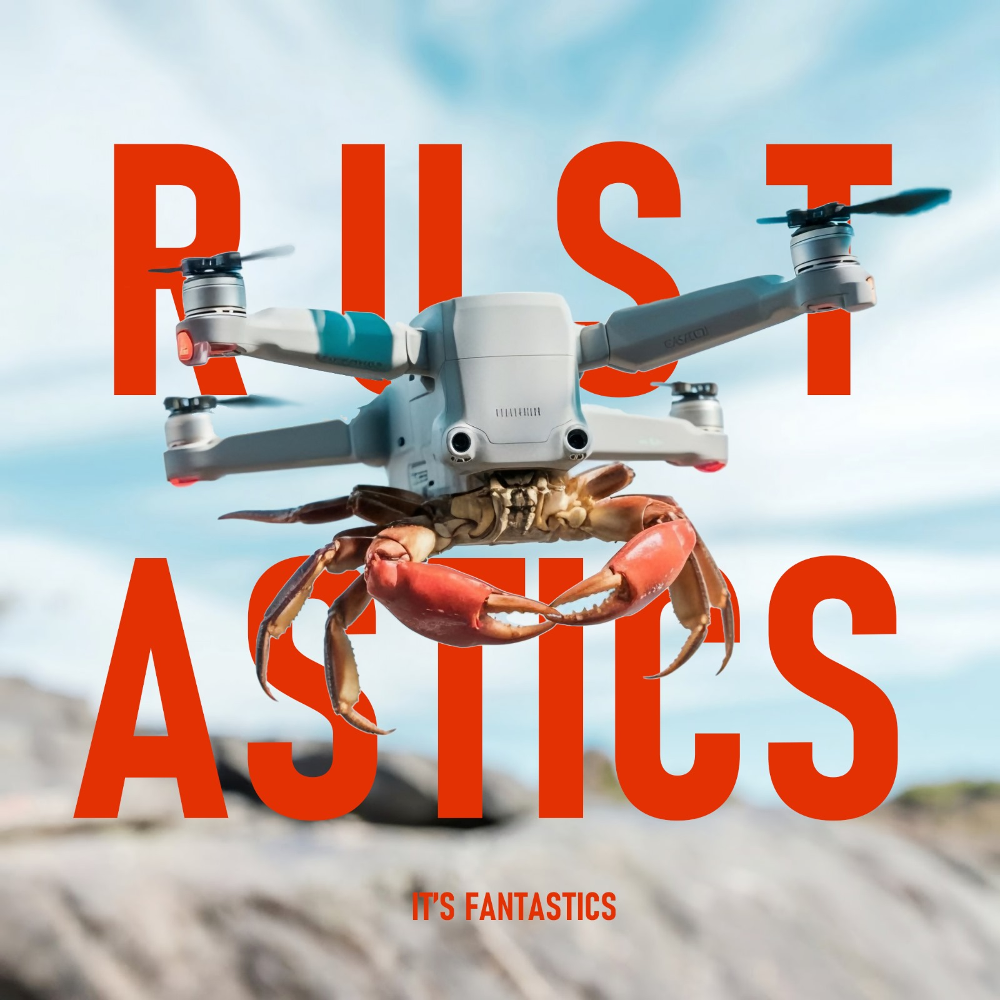

<div align="center">

# RustasticDrone
##### Your drone is Fantastic only if it is from Rustastic



</div>

# TOC
- [Rustastic Drone](#rustastic-drone)
- [Features](#features)
  - [Basic](#basic)
  - [Testing](#testing)
  - [Debugging](#debugging)
- [Buffer](#buffer)
  - [Why Our Buffer Matters](#why-our-buffer-matters)
  - [Statistics](#statistics)
- [Comparison](#comparison)
- [Usage](#usage)
- [Assistance](#assistance)

# Rustastic Drone
The `Rustastic Drone` is a software-defined drone specifically designed for operating within a distributed network simulation. It was developed as a project for the 2024 Advanced Programming course at the [University of Trento](https://www.unitn.it/).

# Features
## Basic
The Rustastic Drone aims to the **protocol perfection**: we meticulously developed and refined every aspect of the protocol to
ensure seamless communication and operation.

## Testing
The Rustastic Drone undergoes **extensive testing**, in fact every feature and function is rigorously tested to guarantee robustness
and performance under all conditions. We are also careful to cover, in our tests, every **edge-case** that comes to mind: we’ve implemented numerous tests to cover even the rarest edge cases, leaving no room for unexpected behavior. We are committed to adding even more tests to ensure that nothing ever goes wrong with our drones.

## Debugging
An important feature of the Rustastic Drone that was implement to make the user experience as **user-friendly** as possible, is the debug. Our code is packed with debug statements to provide clear and detailed information about exactly what happened and in what order.
We also decided to **color these debug logs**: errors and actions are highlighted in different colors, making them easy to spot in the terminal. You won’t need to comb through every line in the CLI to understand what went wrong. We also use the `log` crate ([link](https://docs.rs/log/latest/log/)) so that if the user plans to implement a logger the experience is going to be seamless 


To summarize the `Rustastic Drone` is **Simply Fantastic** because it stands out with its reliability, precision, and smart design.

# Buffer
Our drone uses an efficient `Packet Buffer` to handle dropped fragments. This buffer is implemented as a `HashMap` combined with a `priority queue`, which stores recently received fragments using a session ID and fragment index as keys.

When a NACK is received:
1. The drone checks if the corresponding fragment is stored in the buffer.
2. If the fragment is found, it is immediately retransmitted without requiring a full request from the client.
3. If the fragment is not found, the NACK is forwarded back to the previous node, and the retransmission must restart from the original source.
4. You can **choose the dimension of the buffer**

This approach minimizes delays and network congestion caused by redundant retransmissions.

## Why Our Buffer Matters
Efficient packet handling is crucial in drone networks where delays or dropped packets can disrupt communication. Our buffer system ensures:
* Faster retransmissions.
* Lower congestion.
* Greater reliability in challenging environments.

Whether in simulations or real-world applications, our buffer technology makes the drone network faster, smarter, and more resilient.

## Statistics
<div align="center">


</div>

# Comparison
<div align="center">


</div>

# Usage
Add the following to your `Cargo.toml`

```toml
[dependencies]
rustastic-drone = { git = "https://github.com/Rustastic/RustasticDrone.git" }
```

To use in your code:
``` rust
use rustastic_drone::RustasticDrone;
```

# Assistance